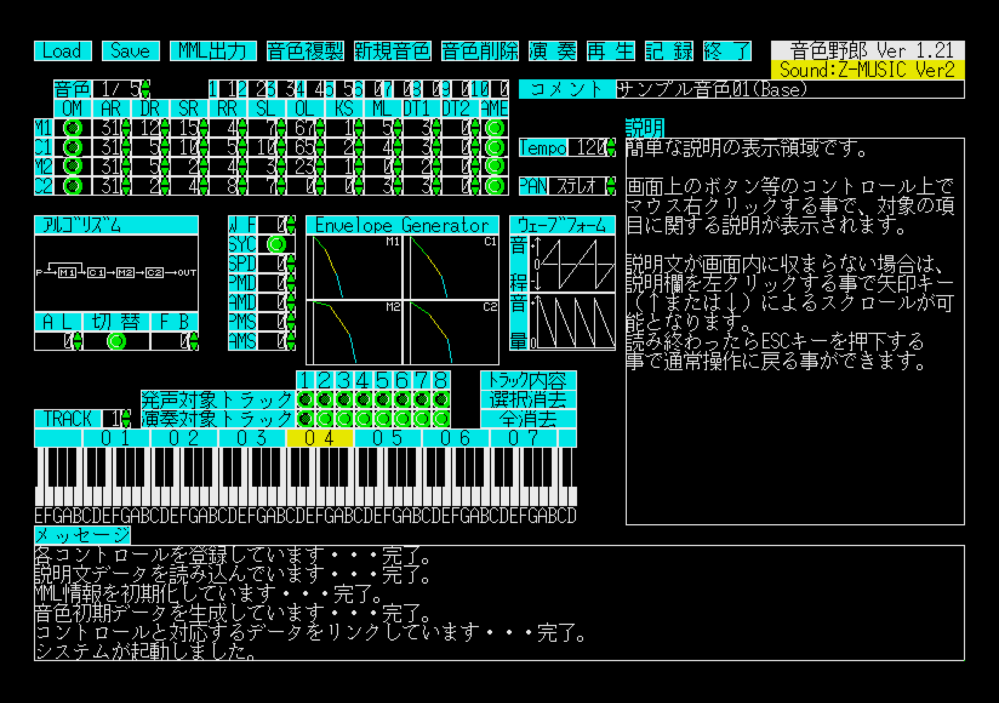
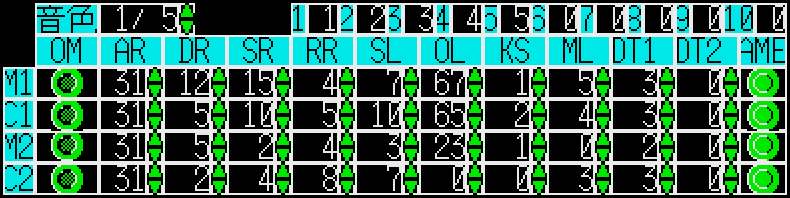
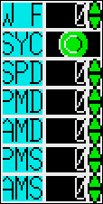
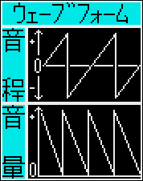
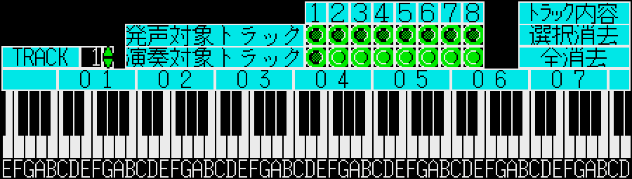

# 音色野郎　操作説明　(Version 1.21)
***

## 目次
- [音色野郎　操作説明　(Version 1.21)](#音色野郎操作説明version-121)
  - [目次](#目次)
  - [事前に準備が必要なソフトウェア](#事前に準備が必要なソフトウェア)
  - [始動後の画面](#始動後の画面)
  - [音源ドライバ種別](#音源ドライバ種別)
  - [コントロールの説明](#コントロールの説明)
    - [コマンドボタン](#コマンドボタン)
    - [音色パラメータ（１）](#音色パラメータ１)
    - [音色パラメータ（２）](#音色パラメータ２)
    - [音色パラメータ（３）](#音色パラメータ３)
    - [テンポ・パンポット](#テンポパンポット)
    - [コメント](#コメント)
    - [演奏関連コントロール](#演奏関連コントロール)
    - [メッセージ系コントロール](#メッセージ系コントロール)
***
## 事前に準備が必要なソフトウェア
本ソフトウェアの動作には以下のソフトウェアが必要となりますので、事前の入手が必要です。

1. [**IOCS.X**]または[**HIOCS.X**] 
上記ソフトウェアは、テキスト画面の矩形領域スクロールを行う為に必要です。なお**HIOCS.X**はVer 1.10+16.19以降が必要で、それ以前のバージョンでは正しく動作しません。  
1. 音源ドライバ 
本ソフトウェアはFM音源ドライバとして**Z-MUSIC**または**OPMDRV3.X**を前提としており、他のドライバでは動作致しません。**（Z-MUSIC Ver 3には対応していません）** 
Ver1.10より**Z-MUSIC Ver 2.08**を同梱していますので、こちらをご利用いただく事で本ソフトウェアが運用できます。 
**OPMDRV3.X**をお持ちの方は**Z-MUSIC**の代わりにこちらを常駐させる事で本ソフトウェアを運用できますが、再生演奏時のキーボード表示機能はご利用いただけません。

上記ソフトウェアを常駐させた後で本プログラム「SoundEdt.X」を起動すると、必要データを読み込んでシステムが起動します。**（なお、説明文データの読み込みに若干の時間がかかります。）**

## 始動後の画面
システムが起動すると、以下の画面が表示されます。

<strong>－編集中の簡易演奏について－</strong>
始動直後から、現在編集中の音色のみキーボードからの簡易演奏を行い音色の状態を確認できます。
なお、簡易演奏の際のキー操作に関しては後述の[コマンドボタン](###コマンドボタン)内の<strong>[演奏]ボタン</strong>の項をご参照ください。

<strong>◆注意点◆</strong>
<strong>[演奏]ボタン</strong>押下時の演奏モードのみ音色の切替が行えます。編集画面での簡易演奏モードでは現在編集中の音色のみを演奏対象とする為、<strong>音色の変更は行えません。</strong>

また、簡易演奏モードは画面上の編集内容を反映する為に、画面上のパラメータ変更後は音源初期化の都合上、キー押下しても発声が遅れますので少し（１秒足らずですが）待ってからの操作をお勧めします。

## 音源ドライバ種別
画面右上に、現在使用中の音源ドライバ種別が表示されます。

<table border="1">
<caption>音源ドライバの種類</caption>
<thead>
<tr>
<th>Z-MUSICの場合</th><th>OPMDRV3の場合</th>
</tr>
</thead>
<tr>
<td></td>
<td></td>
</tr>
</table>

## コントロールの説明
以下に、画面上の各コントロールの説明を記述します。
***
### コマンドボタン
画面上部に並ぶボタンについて解説します。 

<table border="1">
<caption>ボタンの種類</caption>
<thead>
<tr>
<th>ボタン名称</th><th>説明</th>
</tr>
</thead>
<tr>
<td>[ Load ]</td>
<td>
 
音色と演奏内容を記録したデータファイルを読み込みます。 
入力ファイル名は「<strong>SaveData.dat</strong>」固定です。 
データファイルが存在しないか読み込みに失敗した場合には、サンプルの音色データが設定されます。
</td>
</tr>
<tr>
<td>[ Save ]</td>
<td>
 
音色と演奏内容をデータファイルに出力します。 
出力ファイル名は「<strong>SaveData.dat</strong>」固定です。
</td>
</tr>
<tr>
<td>[ MML出力 ]</td>
<td>
 
音色と、記録した演奏内容をMMLデータとしてテキストファイルに出力します。 
MML書式はZ-MUSIC Ver2.08の<strong>ZMS形式</strong>またはOPMDRV3の<strong>OPM形式</strong>に準拠しており、 
<strong>Z-MUSIC Ver3.0との互換性はありません。</strong> 
出力ファイル名は、<strong>Z-MUSIC</strong>常駐時は「<strong>ZmsData.ZMS</strong>」、 
<strong>OPMDRV3</strong>常駐時は「<strong>OpmData.OPM</strong>」固定です。 
また、演奏データをMMLに変換する際に音長の「丸め」が発生しますので、 
実際の演奏とは音符の長さが異なったMMLデータが出力される事があります。 
<strong>※出力したMMLを再度読み込む機能は搭載しておりません。</strong>
</td>
</tr>
<tr>
<td>[ 音色複製 ]ボタン</td>
<td>
 
現在選択している音色データを複製します。 
複製された音色データは、現在登録されている音色データ群の末尾に追加されます。
</td>
</tr>
<tr>
<td>[ 新規音色 ]ボタン</td>
<td>
 
音色データを新規作成します。 
新規追加された音色データには、あらかじめサンプルの音色パラメータが設定されています。 
作成された音色データは、現在登録されている音色データ群の末尾に追加されます。</td>
</tr>
<tr>
<td>[ 音色削除 ]ボタン</td>
<td>
 
現在選択している音色データを削除します。 
削除したデータ以降の音色番号は再度発番される為、演奏を記録した後に音色を削除すると 
正しく演奏されなくなる可能性があります。
</td>
</tr>
<tr>
<td>[ 演奏 ]ボタン</td>
<td>
 
キーボードによる演奏を行います。 
演奏開始時点で選択中の音色が使用されますが、キーボードからの操作で演奏に使用する 
音色や音階をリアルタイムで切り替える事ができます。 
キーボード上のキー割り当ては以下の通りです。
<table>
    <caltion></caption>
    <thead>
        <tr>
            <th>キー</th><th>機能</th>
        </tr>
    </thead>
    <tr>
    <td>[1]～[9]</td>
    <td>
    音程（オクターブ）切替 
    ※音源ドライバの仕様上、オクターブ0～8となっていますが 
    キーボード操作との対応の兼ね合いで[1]がオクターブ0、[2]がオクターブ1、 
    [9]がオクターブ8に対応しています。
    </td>
    </tr>
    <tr>
    <td>[Q]～[P]</td>
    <td>
    音色切替 
    音色バンク内の音色を切り替えます。「Q」が音色バンクの1番目、 
    「W」が2番目に対応し「P」が最後の10番目に対応します。 
    （音色バンクに関しては後述）
    </td>
    </tr>
    <tr><td>[Z]～[M]</td><td>演奏</td></tr>
</table>
演奏に用いるキーの割り当ては以下の通りです。
<table>
    <caltion></caption>
    <thead>
        <tr>
            <th>キー</th><th>対応する音</th>
        </tr>
    </thead>
    <tr><td>[Z]</td><td>「ド」MML表記の「C」に対応します。</td></tr>
    <tr><td>[S]</td><td>「ド#」MML表記の「C#」に対応します。</td></tr>
    <tr><td>[X]</td><td>「レ」MML表記の「D」に対応します。</td></tr>
    <tr><td>[D]</td><td>「レ#」MML表記の「D#」に対応します。</td></tr>
    <tr><td>[C]</td><td>「ミ」MML表記の「E」に対応します。</td></tr>
    <tr><td>[V]</td><td>「ファ」MML表記の「F」に対応します。</td></tr>
    <tr><td>[G]</td><td>「ファ#」MML表記の「F#」に対応します。</td></tr>
    <tr><td>[B]</td><td>「ソ」MML表記の「G」に対応します。</td></tr>
    <tr><td>[H]</td><td>「ソ#」MML表記の「G#」に対応します。</td></tr>
    <tr><td>[N]</td><td>「ラ」MML表記の「A」に対応します。</td></tr>
    <tr><td>[J]</td><td>「ラ#」MML表記の「A#」に対応します。</td></tr>
    <tr><td>[M]</td><td>「シ」MML表記の「B」に対応します。</td></tr>
    <tr><td>[ESC]</td><td>演奏モードを終了します。</td></tr>
</table>
<strong>※演奏可能な範囲について</strong> 
音源ドライバの仕様により、演奏可能な音の範囲は 
「オクターブ0のレ#（D#）～オクターブ8のレ（D）まで」となっています。
</td>
</tr>
<tr>
<td>[ 再生 ]ボタン</td>
<td>
 
[記録]ボタンで記録した演奏内容を自動演奏で再生します。 
その際、<strong>[発声対象トラック]</strong>で選択されているトラックのみ発声します。
</td>
</tr>
<tr>
<td>[ 記録 ]ボタン</td>
<td>
 
キーボードでの演奏を記録します。 
記録は<strong>[TRACK]</strong>または<strong>[演奏対象トラック]</strong>で選択されたトラックに対して行われます。
X68000のFM音源は最大8つのトラックを持っており最大8重和音での演奏が可能ですが 
本ソフトウェアでは1度に1トラックずつしか記録できない為、 
記録対象のトラックを<strong>[TRACK]</strong>または<strong>[演奏対象トラック]</strong>で指定します。
こうして1トラックずつ個別に記録した演奏データは<strong>[再生]</strong>ボタンで全トラックを同時再生できますが、<strong>[発声対象トラック]</strong>で任意のトラックのみ再生する事も可能です。

</td>
</tr>
<tr>
<td>[ 終了 ]ボタン</td>
<td>
 
本ソフトウェアを終了します。 
編集中のデータは失われるので、事前に保存して下さい。
</td>
</tr>
</table>

***
### 音色パラメータ（１）
音色番号と、オペレータ（<strong>[M1]</strong>～<strong>[C2]</strong>）毎のパラメータ欄について解説します。 

<table border="1">
    <caption></caption>
    <thead>
        <tr>
            <th>コントロール名称</th><th>説明</th>
        </tr>
    </thead>
    <tr>
        <td>[ 音色番号 ]欄</td>
        <td> 
        現在編集中の音色番号を表示します。 
        表示は「音色番号／音色総数」形式となっており「音色番号」が現在選択し編集中の 
        音色番号、「音色総数」が現在システムに登録されている音色の総数を表し、 
        入力／選択できるのは、この音色総数が上限となります。 
        「音色番号」欄に値を入力または右側の矢印（▲および▼）をクリックし 
        値を増減させる事で、選択する音色を切り替えられます。 
        数値欄での入力中にカーソルキーの上下を押す事で値を上下させられます。 
        また、<strong>どちらのボタンの上でもマウス右ボタンをクリックする事で 
        値を下げる事ができます。</strong> 
        （▲ボタンの上で左右のボタン操作のみで値を上下できます）</td>
    </tr>
    <tr>
        <td>[ 音色バンク ]欄</td>
        <td>
             
            登録されている音色をキーボードに割り当てる入力欄です。 
            登録されている音色のうち最大10個までをキーボードでの音色切替に割り当てる事ができ、 
            その内訳が表示されます。　ラベル番号の「1」～「0」が、 
            それぞれキーボードの「Q」～「P」に対応しており演奏中に対応するキーを押下する事で 
            リアルタイムに音色を切り替えて演奏できます。 
            また、任意の欄に音色番号を入力する事で上記のキーに切り替え用の音色番号を設定できます。 
            数字の「1」～「10」はキーボードの「Q」～「P」に対応しており、 
            例えば演奏中に「E」キー押下で音色バンク欄の「3」に入力されている音色に切り替わり、 
            「P」キーを押下する事で音色バンク欄の「10」に入力されている音色に切り替わります。 
            <dl>
                <dt>■入力欄とキーの対応</dt>
                <dd>[1] …キーボードの[Q]</dd>
                <dd>[2] …キーボードの[W]</dd>
                <dd>[3] …キーボードの[E]</dd>
                <dd>[4] …キーボードの[R]</dd>
                <dd>[5] …キーボードの[T]</dd>
                <dd>[6] …キーボードの[Y]</dd>
                <dd>[7] …キーボードの[U]</dd>
                <dd>[8] …キーボードの[I]</dd>
                <dd>[9] …キーボードの[O]</dd>
                <dd>[10]…キーボードの[P]</dd>
            </dl>
        </td>
    </tr>
    <tr>
        <td>[ OM ]欄</td>
        <td>
         
        ースロットマスクー 
        オペレータのON/OFFを設定します。　<strong>[M1]</strong>～<strong>[C2]</strong>の４つあるオペレータに対してONとOFFを設定します。　左横に<strong>[M1]</strong>～<strong>[C2]</strong>のオペレータ名が表示されており、それぞれ個別にON/OFFを設定できます。 
        ON状態でが表示され、OFF状態でが表示されます。 
        オペレータ単位で機能するので、OFFに設定されたオペレータの設定値（<strong>[AR]</strong>～<strong>[AME]</strong>）全てが無効となります。
        </td>
    </tr>
    <tr>
        <td>[ AR ]欄</td>
        <td>
         
        ーアタックレートー 
        キーオン（音が発生する瞬間のこと）されてから、 
        音の出力が最大になるまでの速度を指定します。 
        入力値の範囲は0～31です。 
        数値が小さいとジワッと徐々に出る音になり、逆に数値が大きくなるほど音の立ち上がりが速くなり 
        ピアノのようにハッキリした音の出方になります。 
        
        </td>
    </tr>
    <tr>
        <td>[ DR ]欄</td>
        <td>
         
        ーFirst Decay Rateー 
        <strong>[D1R]</strong>や<strong>[1DR]</strong>とも表記されます。 
        出力レベルが最大になってから、<strong>[SL]</strong>で設定したレベルに下がるまでの速度を設定します。 
        入力値の範囲は0～31です。　値が大きくなるほど音の減衰速度が速くなり、音が小さくなっていくのが速まります。 
        ー<strong>[SR]</strong>との違いー 
        <strong>[DR]</strong>で設定するのは、以下に示すように最大出力から<strong>[SL]</strong>までの範囲の減衰度合です。　<strong>[SL]</strong>以降の減衰度合は<strong>[SR]</strong>にて設定します。 
        
        </td>
    </tr>
    <tr>
        <td>[ SR ]欄</td>
        <td>
         
        －Second Dacey Rate－ 
        <strong>[D2R]</strong>や<strong>[2DR]</strong>とも表記されます。 
        <strong>[SL]</strong>で指定した出力レベルになってから、キーオフ（鍵盤を放す）されるまでの速度を設定します。　入力値の範囲は0～31です。 
        値が大きくなるほど音の減衰速度が速くなり、音が小さくなっていくのが速まります。 
        －<strong>[DR]</strong>との違い－ 
        <strong>[SR]</strong>で設定するのは、以下に示すように<strong>[SL]</strong>からキーオフ(キーが放される)までの範囲の減衰度合です。　<strong>[SL]</strong>以前の減衰度合は<strong>[DR]</strong>にて設定します。 
        
        </td>
    </tr>
    <tr>
        <td>[ RR ]欄</td>
        <td>
         
        －Release Rate－ 
        キーオフ（鍵盤を放す）されてから音が消えるまでの速度を設定します。　数値が大きくなるほど、キーオフしてからの音の減衰が速くなります。　入力値の範囲は0～15です。 
        値を大きくすると鍵盤を押している間のみ鳴るような、後を引かずにピタリと止まるような音の出方になり、逆に値を小さくすると鍵盤を放した後も余韻を残すような音の出方になります。 
        
        </td>
    </tr>
    <tr>
        <td>[ SL ]欄</td>
        <td>
         
        －First Decay Level－ 
        <strong>[D1L]</strong>や<strong>[1DL]</strong>とも表記されます。 
        <strong>[DR]</strong>から<strong>[SR]</strong>に移る閾値となる出力レベルを設定します。　入力値の範囲は0～15です。 
        数値が大きくなるほど閾値となる出力レベルが低くなります。
        <dl>
        <dt>値の内訳</dt>
        <dd>0…減衰量 0db　 8…減衰量24db</dd>
        <dd>1…減衰量 3db　 9…減衰量27db</dd>
        <dd>2…減衰量 6db　10…減衰量30db</dd>
        <dd>3…減衰量 9db　11…減衰量33db</dd>
        <dd>4…減衰量12db　12…減衰量36db</dd>
        <dd>5…減衰量15db　13…減衰量39db</dd>
        <dd>6…減衰量18db　14…減衰量42db</dd>
        <dd>7…減衰量21db　15…減衰量93db</dd>
        </dl>
        
        </td>
    </tr>
    <tr>
        <td>[ OL ]欄</td>
        <td>
         
        －Output Level(Total Level)－ 
        <strong>[TL]</strong>とも表記されます。 
        音色および音量を制御する為の、各オペレータにおける<strong>EG</strong>のトータル出力レベルを設定します。　入力値の範囲は0～127です。 
        <table border="1">
            <thead><tr><th>EG=Envelope Generator</th></tr></thead>
            <tr>
            <td>
            FM音源の出力に時間的な変化を与える仕組みです。 
            <strong>[AR][DR][SR][RR]</strong>の４つの設定値によって決定されます。
            キャリア（C1、C2）の出力レベルは音量を変化させモジュレータ<strong>（M1、M2）</strong>の出力レベルは音色を変化させます。　数値が大きくなるほど出力レベルは小さくなります。
            </td>
            </tr>
        </table>
        </td>
    </tr>
    <tr>
        <td>[ KS ]欄</td>
        <td>
         
        －Key Scaling－ 
        音の高さ（キーコード）によって、エンベロープ(出力波形)の長さを変化させます。　入力値の範囲は0～3です。 
        数値が大きくなるほど、高音域でのエンベロープの長さが短くなり、音色が鋭くなります。
        </td>
    </tr>
    <tr>
        <td>[ ML ]欄</td>
        <td>
         
        －Phase Multiply－ 
        <strong>[M1]</strong>～<strong>[C2]</strong>の各オペレータ周波数を設定します。　入力値の範囲は0～15です。 
        設定値は、鍵盤標準ピッチに対する周波数の比を表します。(0の場合は1/2の周波数)
        </td>
    </tr>
    <tr>
        <td>[ DT1 ]欄</td>
        <td>
         
        －Detune 1－ 
        <strong>[M1]</strong>～<strong>[C2]</strong>各オペレータのピッチを微妙にずらす事により、音の波の緩衝作用を起こして音に広がりを与えます。　入力値の範囲は0～7です。
        <dl>
        <dt>値の内訳</dt>
        <dd>0…ピッチ変化＝0</dd>
        <dd>1…ピッチ変化＝+1</dd>
        <dd>2…ピッチ変化＝+2</dd>
        <dd>3…ピッチ変化＝+3</dd>
        <dd>4…ピッチ変化＝0</dd>
        <dd>5…ピッチ変化＝-1</dd>
        <dd>6…ピッチ変化＝-2</dd>
        <dd>7…ピッチ変化＝-3</dd>
        </td>
    </tr>
    <tr>
        <td>[ DT2 ]欄</td>
        <td>
         
        －Detune 2－ 
        <strong>[M1]</strong>～<strong>[C2]</strong>各オペレータの周波数比を非整数倍にしたい場合に設定します。　入力値の範囲は0～3です。 
        値を設定する事で、<strong>[MUL]</strong>で指定された周波数を以下のように変更します。
        <dl>
        <dt>値の内訳</dt>
        <dd>0…<strong>[ML]</strong>で指定した周波数の1.00倍</dd>
        <dd>1…<strong>[ML]</strong>で指定した周波数の1.41倍</dd>
        <dd>2…<strong>[ML]</strong>で指定した周波数の1.57倍</dd>
        <dd>3…<strong>[ML]</strong>で指定した周波数の1.73倍</dd>
        </dl>
        </td>
    </tr>
    <tr>
        <td>[ AME ]欄</td>
        <td>
         
        －AMS Enable－ 
        <strong>[M1]</strong>～<strong>[C2]</strong>各オペレータのAMSをON/OFFします。
        ONにする事で<strong>[AMS]</strong>に設定したLFOの感度が有効になります。
        ※ONの場合「●」が表示され、OFFの場合は空白が表示されます。
        </td>
    </tr>
</table>

***
### 音色パラメータ（２）
アルゴリズムとフィードバックのパラメータ欄について解説します。 

<table border="1">
    <caption></caption>
    <thead>
        <tr>
            <th>コントロール名称</th><th>説明</th>
        </tr>
    </thead>
    <tr>
        <td>[ AL ]欄</td>
        <td>
         
        －Algorithm－ 
        各チャンネル毎の４つのオペレータ(<strong>[M1]</strong>～<strong>[C2]</strong>)の組み合わせを設定します。 
        入力値の範囲は0～7の8種類で、設定値に対応した組み合わせが<strong>[ｱﾙｺﾞﾘｽﾞﾑ]</strong>欄に 
        表示されます。 
        <strong>[M1][M2]</strong>をモジュレータ、<strong>[C1][C2]</strong>をキャリアと呼びます。
        サイン波など音の源となる波形を生成するのがキャリアで、<strong>[C1][C2]</strong>が該当します。
        それに対して変調をかけてキャリアの生成した音に変化を付ける役割を持つのが 
        モジュレータで、<strong>[M1][M2]</strong>が該当します。
        </td>
    </tr>
    <tr>
        <td>[切替]欄</td>
        <td>
         
        アルゴリズム、Envelope Generatorのオペレータ表記をSHARPのマニュアルに 
        記載されている形式（M1～C2）と、シンセサイザ等で用いられる形式（1～4） 
        とで切り替えます。 
        見た目が変化するだけなので、実際にはパラメータの値や音色に違いは出ま 
        せん。
        </td>
    </tr>
    <tr>
        <td>[ FB ]欄</td>
        <td>
         
        －Feed Back－ 
        各チャンネル毎の最初のオペレータの出力を、そのオペレータ自身に戻す事により１つのオペレータだけで変調が行えます。　入力値の範囲は0～7の8段階です。 
        数値が大きくなるほど大きく変調されて高周波成分が増え、音色が大きく変わります。
        <dl>
        <dt>値の内訳</dt>
        <dd>0…OFF</dd>
        <dd>1…π/16</dd>
        <dd>2…π/8</dd>
        <dd>3…π/4</dd>
        <dd>4…π/2</dd>
        <dd>5…π</dd>
        <dd>6…2π</dd>
        <dd>7…4π</dd>
        </td>
    </tr>
</table>

***
### 音色パラメータ（３）
LFO（低周波発振器）関連のパラメータ欄について解説します。 

　　　
<table border="1">
    <caption></caption>
    <thead>
        <tr>
            <th>コントロール名称</th><th>説明</th>
        </tr>
    </thead>
    <tr>
        <td>[ WF ]欄</td>
        <td>
         
        －Wave Form－ 
        LFO(低周波発振器)から発生される波形を選択します。
        波形の違いにより、音量や音色の変化の仕方が変わります。
        入力値の範囲は0～3の4種類で、選択した波形は<strong>[ウェーブフォーム]</strong>欄の<strong>[音程][音量]</strong>グラフに表示されます。
        </td>
    </tr>
    <tr>
        <td>[ SYC ]欄</td>
        <td>
         
        －Synchro－ 
        LFOのスタートとキーオン(音が発生される瞬間)を同期(シンクロ)をON/OFFします。
        ONにする事で音が発生するたびにビブラートやトレモロ等の効果が 
        波形の先頭からかかります。 
        ※ONの場合が表示され、OFFの場合はが表示されます。
        <table border="1">
            <caption></caption>
            <thead>
                <tr>
                    <th>ビブラートとトレモロ</th>
                </tr>
            </thead>
            <tr>
                <td>
                ビブラートとトレモロは似ていますが、ビブラートは音程の揺れ、トレモロは音量の揺れという違いがあります。　　　　　　　　　│
                </td>
            </tr>
        </table>
        </td>
    </tr>
    <tr>
        <td>[ SPD ]欄</td>
        <td>
         
        －Speed－ 
        LFOの発振周波数(ビブラートやトレモロ効果の速さ)を設定します。　入力値の範囲は0～255です。 
        0～255の値は約0.009～59Hzに対応し数値が大きくなるほど周波数が高くなりスピードが上がります。
        </td>
    </tr>
    <tr>
        <td>[ PMD ]欄</td>
        <td>
         
        －Pitch Modulation Depth－ 
        音程への周波数変調に対してかけるLFOの出力レベルを設定します。 
        0(出力レベル小)→127(出力レベル大) 
        入力値の範囲は0～127で、数値が大きくなるほど深くかかります。
        </td>
    </tr>
    <tr>
        <td>[ AMD ]欄</td>
        <td>
         
        －Amplitude Modulation Depth－ 
        音量の振幅変調に対してかけられるLFOの出力レベルを設定します。 
        0(出力レベル小)→127(出力レベル大) 
        入力値の範囲は0～127で、数値が大きくなるほど深くかかります。
        </td>
    </tr>
    <tr>
        <td>[ PMS ]欄</td>
        <td>
         
        －Pitch Modulation Sensitivity－ 
        各チャンネル毎の音程への周波数変調に対してかける LFO の感度を設定します。 
        0(感度小)→7(感度大) 
        数値が大きくなるほど、感度は大きくなります。
        </td>
    </tr>
    <tr>
        <td>[ AMS ]欄</td>
        <td>
         
        －Amplitude Modulation Sensitivity－ 
        各チャンネル毎の音量の振幅変調に対してかけるLFOの感度を設定します。　入力値の範囲は0～3で、数値が大きくなるほど感度は大きくなります。 
        0(感度小)→3(感度大)
        </td>
    </tr>
</table>

***
### テンポ・パンポット
テンポ変更・パンポット（音の左右出力）関連のパラメータ欄について解説します。 

<table border="1">
    <caption></caption>
    <thead>
        <tr>
            <th>コントロール名称</th><th>説明</th>
        </tr>
    </thead>
    <tr>
        <td>[ Tempo ]欄</td>
        <td>
         
        曲のテンポを設定します。　入力値の範囲は30～200です。 
        テンポは１分間に鳴る４分音符の数で表され、初期値は120です。 
        数値が大きくなるほど曲調が速くなり、逆に小さくする事でゆっくりとした曲になって行きます。
        </td>
    </tr>
    <tr>
        <td>[ Pan ]欄</td>
        <td>
         
        －Pan pot－ 
        音の出力方式を設定します。 
        値の範囲は0～3ですが、画面上では数値の直接入力は行わず以下の選択肢から選ぶようになっています。 
        <table border="1">
            <caption></caption>
            <thead>
                <tr>
                    <th>実際の値</th><th>画面上の選択肢</th>
                </tr>
            </thead>
            <tr><td>0</td><td>停止</td></tr>
            <tr><td>1</td><td>左出力</td></tr>
            <tr><td>2</td><td>右出力</td></tr>
            <tr><td>3</td><td>ステレオ</td></tr>
        </table>
        </td>
    </tr>
</table>

***
### コメント
コメント欄について解説します。 

<table border="1">
    <caption></caption>
    <thead>
        <tr>
            <th>コントロール名称</th><th>説明</th>
        </tr>
    </thead>
    <tr>
        <td>[ コメント ]欄</td>
        <td>
         
        編集中の音色データに関するコメントを表示／編集します。　新規作成時には初期値として「サンプル音色(Base)」が設定されています。 
        設定できるコメント文字列は最大96文字で全角半角文字の混在が可能です。 
        設定したコメントは音色データおよびMMLデータにも保存・反映されます。
        </td>
    </tr>
</table>

***
### 演奏関連コントロール
演奏および記録、再生に関するコントロールについて解説します。 

<table border="1">
    <caption></caption>
    <thead>
        <tr>
            <th>コントロール名称</th><th>説明</th>
        </tr>
    </thead>
    <tr>
        <td>[ TRACK ]欄</td>
        <td>
         
        トラック番号を入力する事で、演奏対象<strong>n</strong>のトラックを切り替えます。 
        トラック番号は1～8まで選択でき、選択中のトラックが記録の対象とな
        ります。 
        この数値は<strong>[演奏対象トラック]</strong>欄と連動します。
        </td>
    </tr>
    <tr>
        <td>[ 発声対象トラック ]欄</td>
        <td>
         
        再生時や、記録時に発声させるトラックを指定します。　OFFに設定したトラックは、再生時および記録時に発声しません。
        </td>
    </tr>
    <tr>
        <td>[ 演奏対象トラック ]欄</td>
        <td>
         
        演奏、記録の対象とするトラックを指定します。　記録時は、選択したトラックに演奏
        内容が記録されます。
        </td>
    </tr>
    <tr>
        <td>[ 選択消去 ]ボタン</td>
        <td>
         
        <strong>[演奏対象トラック]</strong>で選択されているトラックの演奏内容を削除します。 
        全てのトラック内容を削除するには、<strong>[全消去]</strong>ボタンを使用します。
        </td>
    </tr>
    <tr>
        <td>[ 全消去 ]ボタン</td>
        <td>
         
        全トラックの演奏内容を削除します。　任意のトラック内容を削除するには、<strong>[演奏対象トラック]</strong>で消去対象のトラックを選んでから<strong>[選択消去]</strong>ボタンを使用します。
        </td>
    </tr>
    <tr>
        <td>[ 鍵盤 ]</td>
        <td>
         
        演奏／再生の際、発声中の音に対応した鍵盤が赤く点灯します。 
        鍵盤下のアルファベット表記は音階を表し<strong>[C]</strong>が<strong>[ド]</strong>、<strong>[D]</strong>が<strong>[レ]</strong>、<strong>[B]</strong>が<strong>[シ]</strong>に対応します。 
        <strong>※現状、OPMDRV3環境下では再生時の鍵盤表示は機能致しません。</strong>
        </td>
    </tr>
</table>

***
### メッセージ系コントロール

<table border="1">
    <caption></caption>
    <thead>
        <tr>
            <th>コントロール名称</th><th>説明</th>
        </tr>
    </thead>
    <tr>
    <tr>
        <td>[ 説明 ]欄</td>
        <td>
         
        簡単な説明の表示領域です。 
        画面上のボタン等のコントロール上で<strong>CTRLキーを押しながら</strong>マウス右クリックする事で、対象の項目に関する説明が表示されます。 
        説明文が画面内に収まらない場合は、説明欄を左クリックする事で矢印キー（↑または↓）によるスクロールが可能となります。 
        読み終わったらESCキーを押下する事で通常操作に戻る事ができます。
        </td>
    </tr>
    <tr>
        <td>[ メッセージ ]欄</td>
        <td>
         
        システムからのメッセージが表示されます。
        </td>
    </tr>
</table>
